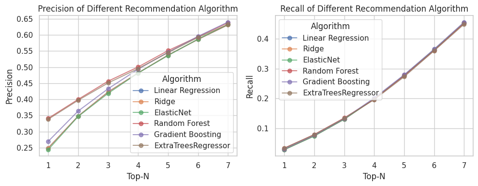
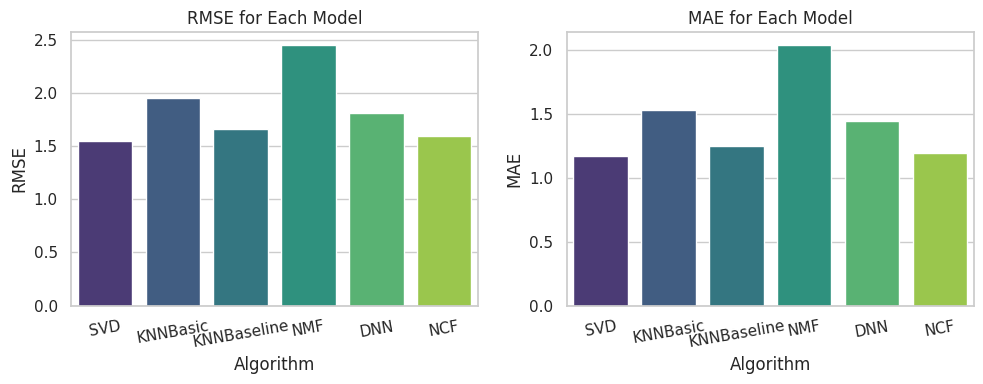
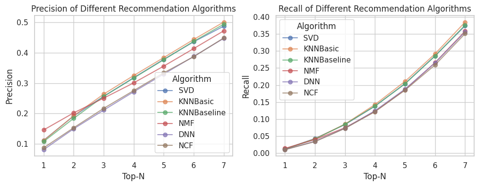

# 📚 도서 추천 시스템 Book_Recommend_System

이 프로젝트는 사용자에게 최적의 도서를 추천하기 위해 다양한 추천 알고리즘을 활용한 도서 추천 시스템입니다. 사용자 선호도와 책의 특성을 분석하여, 개인화된 추천을 제공합니다.

## 🌟 소개

이 도서 추천 시스템은 사용자 데이터와 도서 정보를 기반으로, 다양한 추천 알고리즘을 결합하여 맞춤형 도서를 추천합니다. 시스템은 머신 러닝 기법을 활용하여 추천 품질을 향상시키고 있습니다.
https://www.kaggle.com/datasets/arashnic/book-recommendation-dataset

## ⚙️ 기능

다양한 추천 알고리즘
성능 평가 및 개선 기능
사용자 맞춤형 도서 추천 클래스 구현

## 🧠 알고리즘

Matrix Factorization (SVD): 사용자와 도서 간의 평점을 행렬로 변환하여 숨겨진 요인을 추출합니다.

Gradient Boosting Regressor (GBR): 사용자 특성을 기반으로 추천 품질을 높입니다.

Content-Based Filtering: 사용자가 선호하는 도서의 속성을 분석하여 유사한 도서를 추천합니다.

Popularity-Based 추천: 인기 있는 도서를 추천하여 사용자에게 다양한 선택지를 제공합니다.

## 📈 결과물

이 시스템은 다음과 같은 성능 결과를 보여주었습니다:

## 📚 추천 도서

### 1. Content-Based Filtering (content_rec_result)

<table border="1" class="dataframe">
  <thead>
    <tr style="text-align: right;">
      <th></th>
      <th>user_id</th>
      <th>isbn</th>
      <th>book_title</th>
      <th>book_author</th>
    </tr>
  </thead>
  <tbody>
    <tr>
      <th>0</th>
      <td>41589</td>
      <td>0002005018</td>
      <td>Clara Callan</td>
      <td>Richard Bruce Wright</td>
    </tr>
    <tr>
      <th>1</th>
      <td>41589</td>
      <td>0374157065</td>
      <td>Flu: The Story of the Great Influenza Pandemic of 1918 and the Search for the Virus That Caused It</td>
      <td>Gina Bari Kolata</td>
    </tr>
    <tr>
      <th>2</th>
      <td>41589</td>
      <td>0399135782</td>
      <td>The Kitchen God's Wife</td>
      <td>Amy Tan</td>
    </tr>
    <tr>
      <th>3</th>
      <td>41589</td>
      <td>0425176428</td>
      <td>What If?: The World's Foremost Military Historians Imagine What Might Have Been</td>
      <td>Robert Cowley</td>
    </tr>
    <tr>
      <th>4</th>
      <td>41589</td>
      <td>0671870432</td>
      <td>PLEADING GUILTY</td>
      <td>Scott Turow</td>
    </tr>
    <tr>
      <th>5</th>
      <td>41589</td>
      <td>1881320189</td>
      <td>Goodbye to the Buttermilk Sky</td>
      <td>Julia Oliver</td>
    </tr>
    <tr>
      <th>6</th>
      <td>41589</td>
      <td>0440234743</td>
      <td>The Testament</td>
      <td>John Grisham</td>
    </tr>
    <tr>
      <th>7</th>
      <td>41589</td>
      <td>0452264464</td>
      <td>Beloved (Plume Contemporary Fiction)</td>
      <td>Toni Morrison</td>
    </tr>
    <tr>
      <th>8</th>
      <td>41589</td>
      <td>0609804618</td>
      <td>Our Dumb Century: The Onion Presents 100 Years of Headlines from America's Finest News Source</td>
      <td>The Onion</td>
    </tr>
    <tr>
      <th>9</th>
      <td>41589</td>
      <td>1841721522</td>
      <td>New Vegetarian: Bold and Beautiful Recipes for Every Occasion</td>
      <td>Celia Brooks Brown</td>
    </tr>
  </tbody>
</table>

### 2. 머신 러닝 기반 추천 (ml_rec_result)

<table border="1" class="dataframe">
  <thead>
    <tr style="text-align: right;">
      <th></th>
      <th>user_id</th>
      <th>isbn</th>
      <th>book_title</th>
      <th>book_author</th>
    </tr>
  </thead>
  <tbody>
    <tr>
      <th>0</th>
      <td>41589</td>
      <td>039483609X</td>
      <td>The Black Stallion-Pa (Black Stallion (Paperback))</td>
      <td>Walter Farley</td>
    </tr>
    <tr>
      <th>1</th>
      <td>41589</td>
      <td>157344166X</td>
      <td>Real Live Nude Girl: Chronicles of Sex-Positive Culture</td>
      <td>Carol Queen</td>
    </tr>
    <tr>
      <th>2</th>
      <td>41589</td>
      <td>0553568817</td>
      <td>The Fannie Farmer Cookbook</td>
      <td>Marion Cunningham</td>
    </tr>
    <tr>
      <th>3</th>
      <td>41589</td>
      <td>0345278666</td>
      <td>Desert Solitaire a Season In the Wildern</td>
      <td>Edward Abbey</td>
    </tr>
    <tr>
      <th>4</th>
      <td>41589</td>
      <td>0517583569</td>
      <td>The Little Grain Cookbook</td>
      <td>Patricia Stapley</td>
    </tr>
    <tr>
      <th>5</th>
      <td>41589</td>
      <td>0517575337</td>
      <td>Heartland: The Best of the Old and the New from Midwest Kitchens</td>
      <td>Marcia Adams</td>
    </tr>
    <tr>
      <th>6</th>
      <td>41589</td>
      <td>0670887269</td>
      <td>Pug Shots</td>
      <td>Jim Dratfield</td>
    </tr>
    <tr>
      <th>7</th>
      <td>41589</td>
      <td>0895773759</td>
      <td>ABC's of the Bible</td>
      <td>Reader's Digest</td>
    </tr>
    <tr>
      <th>8</th>
      <td>41589</td>
      <td>0767910036</td>
      <td>Learning to Float : The Journey of a Woman, a Dog, and Just Enough Men</td>
      <td>LILI WRIGHT</td>
    </tr>
    <tr>
      <th>9</th>
      <td>41589</td>
      <td>0394906012</td>
      <td>The Black Stallion</td>
      <td>WALTER FARLEY</td>
    </tr>
  </tbody>
</table>

### 3. 행렬 분해 (SVD) 기반 추천 (mf_rec_result)

<table border="1" class="dataframe">
  <thead>
    <tr style="text-align: right;">
      <th></th>
      <th>user_id</th>
      <th>isbn</th>
      <th>book_title</th>
      <th>book_author</th>
    </tr>
  </thead>
  <tbody>
    <tr>
      <th>31820</th>
      <td>41589</td>
      <td>0743407075</td>
      <td>Grand Avenue</td>
      <td>Joy Fielding</td>
    </tr>
    <tr>
      <th>65270</th>
      <td>41589</td>
      <td>050552337X</td>
      <td>Rejar (Timeswept)</td>
      <td>Dara Joy</td>
    </tr>
    <tr>
      <th>13339</th>
      <td>41589</td>
      <td>0446364819</td>
      <td>Stork Club</td>
      <td>Iris Ranier Dart</td>
    </tr>
    <tr>
      <th>13374</th>
      <td>41589</td>
      <td>0743442652</td>
      <td>The Pink Magnolia Club</td>
      <td>Geralyn Dawson</td>
    </tr>
    <tr>
      <th>8062</th>
      <td>41589</td>
      <td>3442430879</td>
      <td>Schau Dich nicht um.</td>
      <td>Joy Fielding</td>
    </tr>
    <tr>
      <th>22282</th>
      <td>41589</td>
      <td>0749399570</td>
      <td>The Joy Luck Club</td>
      <td>Amy Tan</td>
    </tr>
    <tr>
      <th>1046</th>
      <td>41589</td>
      <td>067972768X</td>
      <td>The Joy Luck Club (Vintage Contemporaries)</td>
      <td>Amy Tan</td>
    </tr>
    <tr>
      <th>13418</th>
      <td>41589</td>
      <td>9871106181</td>
      <td>El Club Dumas</td>
      <td>Arturo Perez-Reverte</td>
    </tr>
    <tr>
      <th>59436</th>
      <td>41589</td>
      <td>0330348337</td>
      <td>Snakebite Survivors Club</td>
      <td>Jeremy Seal</td>
    </tr>
    <tr>
      <th>34036</th>
      <td>41589</td>
      <td>8420481025</td>
      <td>El Club Dumas (Alfaguara Hispanica)</td>
      <td>Arturo Perez-Reverte</td>
    </tr>
  </tbody>
</table>

